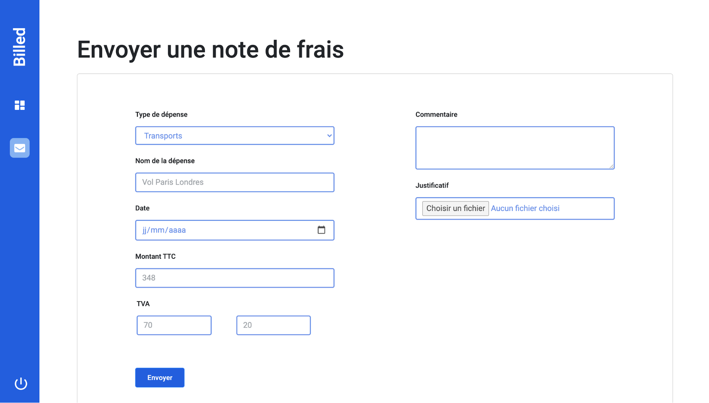

# Formation Développeur d'application - JavaScript React

## 📎 Projet 9 : Billed - Débuggez et testez un SaaS RH



## Technologies :
- HTML
- CSS
- JS
- Jest

 

 ## Tester le projet :

```terminal
git clone https://github.com/Cyril-Develop/DebuggezEtTestezUnSaaSRH.git
```
